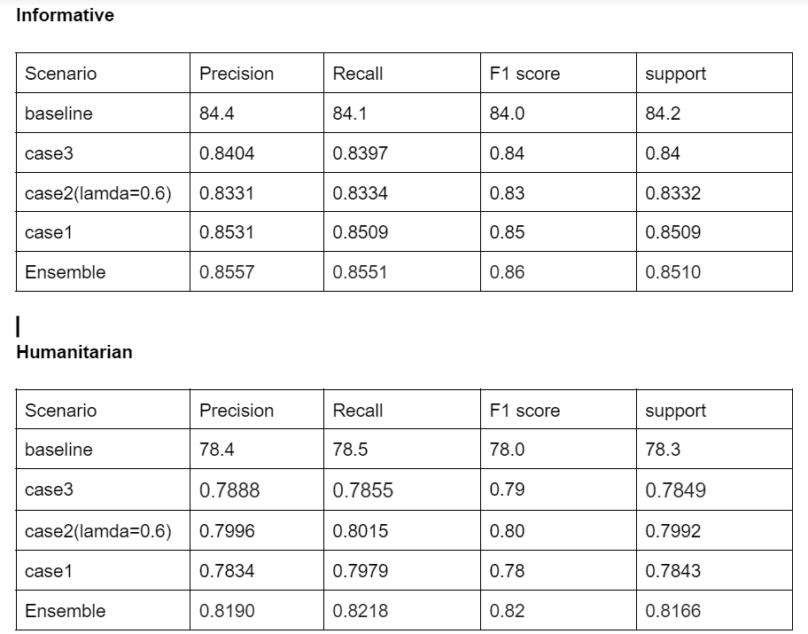
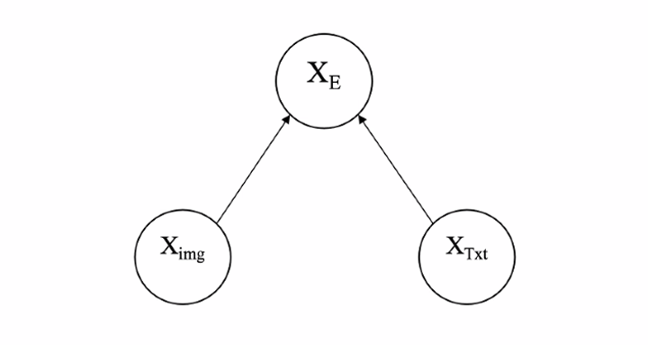
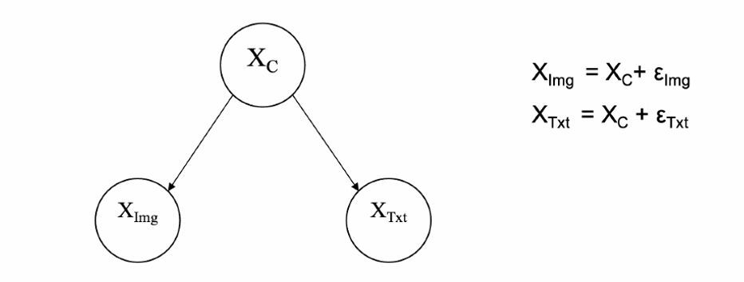

# crisisMMD
crisisMMD

Implementing the [crisisMMD paper](https://arxiv.org/pdf/1805.00713.pdf)


## Usage
Install the module with: `pip install requirements.txt`.

### text model
```python
python textonlymodel.py
```

### image model
```python
python imageonlymodel.py
```
### textimage model
Here we are considering three cases for the model.
1.Concatenation(Case3)
2.Linear transformation(Case1)
3.Log likelihood(Case2)

Run the files which is in the format crisis_(hum/info)_{casetype}.slurm

## Result


### Embedding Model

I have used a pretrained model crisis_word2vec to map words into embedding.

### Dataset

The data is taken from the [crisisMMD dataset](https://crisisnlp.qcri.org/crisismmd)(Folder name:Crisis MMD v2.0)

### Modules Used

1.Keras
2.Tensorflow
3.Pandas
4.PIL

## Documentation

Here the paper talks about 3 tasks with the dataset.Following are tasks metioned:
1)Informative
2)Humanitarian
3)Severity

##Model
Here we are considering 3 Models:
1)Textonly model
2)Image only model
3)Imagetext model

For text:

Text--->emb vectors--->Kim cnn--->softmax classifier

For Image:

Image-->datapreprocess-->vgg16 model--->classifier

For TextImage:

Case1:


Case2:


## References
https://github.com/firojalam/crisis_datasets_benchmarks
